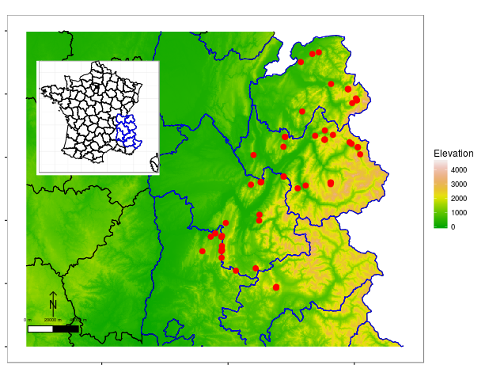

# Authors affiliations

Marc Fuhr^1^, Benoît Courbaud^1^, Thomas Cordonnier^1^, Georges Kunstler^1^, Catherine Riond^2^, Eric Mermin^1^, and Pascal Tardif^1^

^1^ *Univ. Grenoble Alpes, Irstea, UR EMGR, 2 rue de la Papeterie-BP 76, F-38402 St-Martin-d'Hères, France.*

^2^ *National Forest Office, Research, Development and Innovation Unit, 42 quai Charles Roissard, F-73026 Chambéry, France.*

```{r, results="hide", echo=FALSE, message=FALSE}
knitr::opts_chunk$set(tidy=FALSE, warning=FALSE, message=FALSE, error=FALSE, fig.cap="")
options(citation_format = "text", max.names=2, digits=1, width = 400)
require(bibtex)
require(gdata)
require(pander)
metadata_p <- read.csv('../output/metadata_data_p.csv',
                       stringsAsFactors = FALSE)
metadata_c <- read.csv('../output/metadata_data_c.csv',
                       stringsAsFactors = FALSE)
metadata_m <- read.csv('../output/metadata_data_m.csv',
                       stringsAsFactors = FALSE)
code_species <- read.csv('../output/species_code.csv',
                       stringsAsFactors = FALSE)
code_status <- read.csv('../output/status_code.csv',
                       stringsAsFactors = FALSE)
data_c <- read.csv('../output/data_c.csv')
data_m <- read.csv('../output/data_m.csv')
data_p <- read.csv('../output/data_p.csv')
df_growth <- read.csv('../output/df_growth.csv')
table_stand <- read.csv(file.path('..', 'output', 'table_stand_descrip.csv'))
table_allo <- read.csv(file.path('..', 'output', 'table_stand_allo.csv'))
tb_p <- read.csv(file.path('..', 'output', 'table_plot.csv'))
```


## INTRODUCTION

Worldwide forests provide key ecological, economical and socio-cultural services and are major reservoirs of terrestrial biodiversity. Recent studies have, however, pointed out that forest ecosystems are now facing drastic changes, in climate and pattern of anthropogenic and natural disturbances, and that these changes may impact ecosystem services at different temporal and spatial scales [i.e., see @Elkin-2013]. Understanding how forests will adapt to these changes and how forest management can help to mitigate these impacts is crucial and requires long-term monitoring of forest dynamics.
The data set we present consists of a network of 63 forested permanent plots in the French northern Alps (Fig. 1). In this region, forests cover 41\% of the area and climate exhibits high regional variations both along a continental and an elevation gradient, with mediterranean influences in the south. In the network, tree species composition changes with elevation, from European beech (*Fagus sylvatica*) dominated stands in the lower montane (around 800 m a.s.l) belt to Norway spruce (*Picea abies*) dominated stands in the subalpine belt (around 1 900 m a.s.l), with mixed stands of European beech, Silver fir (*Abies alba*) and Norway spruce at intermediate elevations.

Analyse of archival maps from the beginning of the 19^th^ century and aerial photographs from the mid-20^th^ century, have attested that French Alps forests have been continuously forested for more than 200 years [@Janssen-2016]. Most of these ancient forests are now covered by uneven-aged forest stands. Most of the plots were established in such stands. In contrast, some plots were established in stands that originate either from colonization of abandoned agricultural lands or from anthropogenic rehabilitation of degraded lands at the end of the 19th century, that now consist of even-aged stands. 

The dominant management system in the French Alps forests is uneven-aged management and consists of single-tree or small-group selection cutting. Moreover, harvesting rate has been very low for the last 150 years, because forests are being retained to protect the land against natural hazards (snow avalanches, rock falls, erosion) and because of the decrease in the price of wood. Therefore, in comparison with other lowland European forests, forests in the French Alps are enriched in large and old trees and deadwood, and the stand structure is rather heterogeneous [@Paillet-2015]. Consequently, they are considered biodiversity hotspots [@EEA-2010; @Barbati-2014] with high protection, conservation, and economical values. 

Plots were established from 1994 to 2004 and re-measured 2 to 5 times during the 1994-2015 period. Plots were initially established to sample a wide range of forest structure and successional stages to evaluate the forest dynamics through stand development. Data from these plots were then used to calibrate a forest dynamic model Samsara2 [@Courbaud-2015] and to test various silviculture practices. They are now being used to evaluate various ecosystem services (e.g., habitat quality, protection against natural hazard efficiency). The network now represents a promising tool to evaluate the response of mountain forest ecosystems to the combined effect of change in climate and management practices.


<!-- ```{r echo=FALSE, warning=FALSE,  message=FALSE, fig.width= 9, fig.height = 7} -->
<!-- mapplots(data_p) -->
<!-- ``` -->




## METHODS

## METADATA CLASS I. DATA SET DESCRIPTORS

### A. DATA SET IDENTITY
Long-term tree inventory data from mountain forest plots in France.

### B. DATA SET IDENTIFICATION CODE:

ALPFORPLOTS

### C. DATA SET DESCRIPTORS:
**1. Originators**:

Marc Fuhr, Forest Ecology, Univ. Grenoble Alpes, IRSTEA, Mountain Ecosystems Research Unit, Grenoble, France.
<France.Marc.fuhr@irstea.fr>

Benoît Courbaud, Forest Ecology, Univ. Grenoble Alpes, IRSTEA, Mountain Ecosystems Research Unit, Grenoble, France. 
<Benoit.courbaud@irstea.fr>

Thomas Cordonnier, Forest Ecology, Univ. Grenoble Alpes, IRSTEA, Mountain Ecosystems Research Unit, Grenoble, France. 
<Thomas.cordonnier@irstea.fr>

Georges Kunstler, Forest Ecology, Univ. Grenoble Alpes, IRSTEA, Mountain Ecosystems Research Unit, Grenoble, France. 
<Georges.kunstler@irstea.fr>

Catherine Riond, Research, Development and Innovation Unit, National Forest Office, Chambéry, France
<Catherine.riond@onf.fr>

Eric Mermin, Univ. Grenoble Alpes, IRSTEA, Mountain Ecosystems Research Unit, Grenoble, France. 
<Eric.mermin@irstea.fr>

Pascal Tardif, Univ. Grenoble Alpes, IRSTEA, Mountain Ecosystems Research Unit, Grenoble, France. 
<Pascal.tardif@irstea.fr>

**2. Abstract**:

We present repeated tree measurement data from `r length(unique(data_p$plot_id))` permanent plots in mountain forests in France. Plot elevations range from `r min(data_p$elevation, na.rm = TRUE)` (lower limit of the montane belt) to `r max(data_p$elevation, na.rm = TRUE)` m a.s.l (subalpine belt). Forests mainly consist of pure or mixed stands dominated by European beech (*Fagus sylvatica*), Silver fir (*Abies alba*) and Norway spruce (*Picea abies*), in association with various broadleaved species at low elevation and with Arolla pine (*Pinus cembra*) at high elevation. The plot network includes `r nrow(data_p[data_p$management == "UNM", ])` plots in stands that have not been managed for the last 40 years (at least) and `r nrow(data_p[data_p$management == "MAN", ])` plots in plots managed according to an uneven-aged system with single-tree or small-group selection cutting. Plot sizes range from `r min(data_p$area, na.rm = TRUE)` ha to `r max(data_p$area, na.rm = TRUE)` ha. Plots were installed from 1994 to 2004 and re-measured 2 to 5 times during the 1994-2015 period. During the first census (installation), living trees more than 7.5 cm in dbh  were identified, their diameter at breast height (dbh) was measured and their social status (strata) noted. Trees were spatially located, either with x, y and z coordinates (40 plots) or within subplots 0.25 ha square (23 plots). In addition, in a subset of plots (58 plots), tree heights and tree crown dimensions were measured on a subset of trees and dead standing trees and stumps were included in the census. Remeasurements after installation include live tree diameters (including recruited trees), tree status (living, damaged, dead, stump), and for a subset of trees, height. At the time of establishment of the plots, plot densities ranges from `r round(min(table_stand$n_init, na.rm = TRUE))` to `r round(max(table_stand$n_init, na.rm = TRUE))` stemsha^-1^ and plot basal areas ranges from `r round(min(table_stand$ba_init, na.rm = TRUE),1)` to `r round(max(table_stand$ba_init, na.rm = TRUE),1)` m^2^ha^-1^ . 


### D. Key words

France; permanent plot; mountain forest; tree recruitment; tree growth; tree mortality; tree diameter; tree height; tree canopy radius; tree canopy height; forest management; tree spatial coordinates.


## METADATA CLASS II. RESEARCH ORIGIN DESCRIPTORS

### A. "OVERALL" PROJECT DESCRIPTION

**1. Identity**: Long-term tree inventory data from mountain forest plots in France.

**2. Originators**:

The study was first initiated by IRSTEA (National Research Institute of Science and Technology for Environment and Agriculture) in collaboration with ONF (National Forest Office, public institute in charge of the management of public forests in France).

**3. Period of study**: From `r min(data_p$year_first_mes, na.rm = TRUE)` to 2015 (ongoing).

**4. Objectives**:
The objectives are to monitor and analyse changes in forest structure and dynamics for a broad range of stand types in response to changes in management practices and climate conditions in the mountain forests of the French northern Alps.

The network was initially motivated by a change in management regime in the French Alps. Forest management has become very cautious in the French Alps during the 20th century: first, in order to maintain a constant canopy cover that warranties protection against natural hazards [@Cordonnier-2008]; second, because logging operations have become less and less profitable in remote or steep sloped areas. Consequently, mature forest stands dominated by large and very large ageing trees have developed and today cover large areas.

Concern, among forest managers, has been growing since the 1980's about the stability of these stands, fearing that as stand senescence sets it, large gaps will develop that are detrimental to the protective function of the forest [@Leclerc-1998]. Consequently, IRSTEA and ONF started in the 1990’s research programs that aimed at assessing forest stability (resistance and resilience) and developing silvicultural guidelines that maintain or enhance stability.

With ongoing climate change, the network is also providing important information to monitor changes in mountain forests. This long-term tree inventory forest plots is thus now part of the *Zone Atelier Alpes -- ZAA* (LTER France) that focus on global changes impacts on mountain ecosystems.

This dataset has also been used for a wide variety of objectives:

- to calibrate and validate an individual-based and spatially explicit forest dynamics simulation model, called Samsara2, that is currently calibrated for Silver fir and Norway spruce [@Vieilledent-2010a; @Vieilledent-2010b; @Courbaud-2015],

- to train ONF forest managers to simulate harvesting with Samsara2,

- to assess the protection efficiency of the forest against rockfall along a maturity gradient where we stratified plots using maturity structural attributes and then used a rockfall simulation model to simulate impacts on trees taking into account the species, the diameter and the location (x,y) of the trees [@Fuhr-2015],

- to calibrate and validate predictive models of forest stand attributes (height distributions, diameter distributions, basal area, volume, individuals trees location) developed using airborne LiDAR data [@Eysn-2015], and

- to build habitat quality indicators using the dendrometric structure of the plots, combined with data on deadwood [@Redon-2014].

- to test heterogeneity and abundance indices in heterogeneous mountain forest stands in order to link these indices to silvicultural practices and stand history [@Cordonnier-2012].


**6. Sources of funding**:

Plot installation and early monitoring was mainly supported by IRSTEA and ONF internal fundings. Complementary funds from the French Ministry of Environment, the French Ministry of Agriculture and the Vanoise National Park have recently helped with recent census and database development.	

### B. SPECIFIC SUBPROJECT DESCRIPTION

#### II.B.1. Census of stems ≥7.5 cm DBH

**1. Sites description**:

Plots are located in the northern French Alps. Plot location (see Table. 1) is either based on measurement with a differential GPS or an estimation of the position on a 1/25000 map.
Ecological conditions are very heterogeneous (Table. 1). Climate is under oceanic (high precipitations all year long), continental (low precipitations, high seasonality of the temperature) and mediterranean (high temperatures and low precipitations) influences and can be divided into five climatic sectors: external northern sector with an oceanic climate, external southern sector with an oceanic-mediterranean climate, intermediate northern sector with an oceanic-continental climate, internal sector with a continental climate and intermediate southern sector mixing the influences of the three climates. Geology is also highly variable including calcareous and crystalline rocks, schists, alluvium, and moraines (see Table 1 for details per plot). Plot elevations range  from `r min(data_p$elevation, na.rm = TRUE)` m (lower limit of the montane belt) to `r max(data_p$elevation, na.rm = TRUE)` m a.s.l (subalpine belt). Plot slope was derived from a 1/25000 DEM and ranges from `r min(data_p$slope, na.rm = TRUE)` to  `r max(data_p$slope, na.rm = TRUE)`°.

```{r echo=FALSE, message=FALSE, warning=FALSE, comment='', results="asis"}
tb_p[, c(2,6:7)] <- format(round(tb_p[, c(2, 6:7)], 2), nsmall = 2)
tb_p[, 3:5] <- format(round(tb_p[, 3:5], 0), nsmall = 0)
tb_p[, 8] <- format(round(tb_p[, 8], 1), nsmall = 1)
pandoc.table(tb_p,
             digits = 4, split.tables = 200, split.cells = 35)
```
**Table 1:** Plots description (area in ha, MAT: mean annual temperature in °C, MAP: mean total annual precipitation in mm, geol: geology class extracted based on plots location from harmonized geological map of France, BRGM 2004).

**2. Experimental or sampling design**:

Plot selection was based on forest structures typologies from the 1990ies [@Renaud-1994] to validate, with a diachronic approach, forest dynamics patterns inferred from supposed successive structures. A first set of plots was established by IRSTEA in the main structural forest types and then completed by ONF at the beginning of the 2000ies to extend ecocological contexts and silvicultural practices. In the same time, IRSTEA developed an individual-based and spatially explicit forest dynamics simulation model, called Samsara, and established additional plots to calibrate and validate the successive versions of the model. Moreover, specific plots called “marteloscopes” were established by ONF for training purpose (logging simulations by forest managers or researchers).

Forest types in the network (Table. 2) mainly consist of pure or mixed stands dominated by European beech (*Fagus sylvatica*), Silver fir (*Abies alba*) and Norway spruce (*Picea abies*), in association with various broadleaved species at low elevation and with Arolla pine (*Pinus cembra*) at high elevation. The plot network includes 23 plots that have not been managed for at least 40 years and 40 managed plots where the dominant management system is uneven-aged management and consists of single-tree or small-group selection cutting (Table. 2). Harvesting operations are monitored by recording harvested trees.
Plots were installed from 1994 to 2004 and re-measured 2 to 5 times during the 1994-2015 period. Plot sizes range from `r min(data_p$area, na.rm = TRUE)` ha to `r max(data_p$area, na.rm = TRUE)` ha. At the time of establishment of the plots, plot densities ranges from 181 to 1328 stemsha^-1^ and plot basal areas ranges from `r min(table_stand$ba_init, na.rm = TRUE)` to `r max(table_stand$ba_init, na.rm = TRUE)` m^2^ha^-1^ (Table. 2).

```{r echo=FALSE, message=FALSE, warning=FALSE, comment='', results="asis"}
table_stand <- read.csv(file.path('..', 'output', 'table_stand_descrip.csv'))
table_stand$area <- NULL
names(table_stand) <- c('plot_id', 'first year', 'n census', 'Main species', 'n init', 'ba init') 
table_stand[, 6] <- format(round(table_stand[, 6], 2), nsmall = 2)
table_stand[, 5] <- format(round(table_stand[, 5], 0), nsmall = 0)
pandoc.table(table_stand,
             digits = 4, split.tables = 200, split.cells = 35)
```

**Table 2:** Plots characteristics at first census (first year, year of first census; n census, number of census; main species, species representing more than 10\% of the total basal area; n init, tree density per ha at first census; ba init, basal area per ha at first census in  m^2^ha^-1^). Species code explanations can be found in paragraph CLASS IV B (Species code for data_c.csv)

**3. Research methods**:

Tree diameters were measured using the following rules:

1. Tree diameters were measured at breast height (1.3 m from the ground on the uphill side of the stem). Trees leaning more than 45° were noted (`code_status` = 8881) and measured 1.3 m along the underside of the tree.

2. Tree diameters were measured to the nearest millimeter with a diameter tape (`code_diam` = 1). In some plots, however, diameters were measured with a caliper to the nearest 5 millimeters (`code_diam` = 2).

3. Trees that forked above 1.3 m were measured below the fork whereas trees that forked below 1.3 m were measured as separate trees.

4. During the first census, in case of existing deformities precluding normal dbh measurement, tree diameters were measured above or below the deformity. In case of deformities occurring between two successive census, the `code_status` of the tree was modified (`code_status` = 8883) and the dbh was not measured.

5. Paint was used to mark where the dbh was measured on the trees. Trees were individually identified in the field with alphanumeric identifiers (`tree_id`).

6. New trees were recruited at each census.

7. When a tree died between two census, the `code_status` of the tree was modified (`code_status` = 9990) and the dbh was not measured. In the same way, when a tree was logged between two census, the `code_status` of the tree was modified (`code_status` = 9991) and the dbh was not measured. However, in 37 plots, the dbh of the dead standing trees (`code_status` = 9990) and the diameter of the stumps (`code_status` = 9991) were measured during the first census (Table 3).

8. When a tree was not found or when field workers forgot to measure a tree, the `code_status` of the tree was modified (`code_status` = 8880) and the dbh was not measured. 

In 40 plots, tree position was located with x, y coordinates (in the projected plan). In 23 plots the tree position was only located within subplots of 0.25 ha square called quadrats (Table 3). The way trees were located within the plots did not depend on plot size but on plot initial objectives: calibration and validation of forest dynamics models (x,y coordinates) or test of silvicultural practices (assignation to quadrats).

Tree height was measured in `r nrow(table_allo[table_allo$n_h>0, ])` plots on a subset of trees, mostly during the first census (Table. 3). It was defined as the distance from the ground to the uppermost growing tip either using the triangulation method (base distance and slope angle) with a clinometer and a measuring tape or using a Vertex IV ultrasonic hypsometer (Haglof).

Crown dimensions were measured in `r nrow(table_allo[table_allo$n_crown_h>0, ])` plots on a subset of trees, during the first census (Table. 3). They were measured in four perpendicular directions (1 to 4) or two opposite directions (1 and 3). The first direction was on the uphill side of the tree, the third direction was opposite (downhill) and the second/fourth directions were left/right, respectively, of the first dimension. For each direction, crown height (height of the lowest branch) was measured either using triangulation method or Vertex IV. Crown radius (projected plan distance between the trunk and the outermost tip of the largest branch) was measured using a measuring tape.

Tree stratum was visually determined as follows: stand dominant height (H0) was divided in four intervals defining four strata, from the highest stratum (stratum 1: for tree with height (H) ranging from 3/4 of H0 to H0) to the lowest stratum (stratum 4: for trees with H ranging from 0 to 1/4 of H0).

The year when a tree reached 1.3 m was determined by coring in `r sum(table_allo$n_year_1m30 >0)` plots on a subset of trees.

```{r echo=FALSE, message=FALSE, warning=FALSE, comment='', results="asis"}
table_allo <- read.csv(file.path('..', 'output', 'table_stand_allo.csv'))
names(table_allo) <- c('plot_id', 'n h', 'n crown_h', 'n crown_r', 'dead_init_tf', 'xy_tf', 'n_year_1m30') 
pandoc.table(table_allo,
             caption = "",
             digits = 1, split.tables = 200, split.cells = 35)
```

**Table 3:** Additional measurements per plot (n h, number of trees with height measurement; n crown_h, number of trees with crown height measurement; n crown_r, number of trees with crown radius measurement; n year_1.30m, number of cored trees; dead_init_tf, measurement of dead tree at first census or not; xy_tf, measurement of x y coordinates or not; n_year_1m30, number of trees with the year at which 1.3 m was reached).

## CLASS III. DATA SET STATUS AND ACCESSIBILITY

### A. Status

**Latest update**: The dataset being made available through this publication was processed on 10/01/2017.

**Metadata status**: Metadata are current with last update and are stored with the data.

**Data verification**:

Tree dbh measurements were checked against previous values during the collection in the field to ensure consistency. After data entry, homogeneity in species code was checked, and xy coordinates were checked to conform to the plot dimension. We then identified outliers for growth and tree canopy allometry measurements (tree height, crown radius and height). Outliers were identified as points classified as outlier by two methods. First, we fitted a quantile regression  (package quantreg in R cran, see the R code in the .zip file, R directory, ReadData file) at quantile 0.5% and 99.5% with a third degree smoothing function of the explanatory variables (dbh for diameter annual growth, stem height and crown radius, and stem height for crown height) and identified outliers as the point outside this envelope. Secondly, we computed Cook's distances from a linear regression and identified outliers as points with a Cook's distance greater than six times the mean Cook's distance. As an exemple, the figures below present the points identified as outliers by both methods. We checked all points that were identified as outliers through both methods for data entry errors and obvious errors were corrected. All the remaining outliers were left unchanged in the data in order to let data users decide whether additional data cleaning is required. 


```{r echo=FALSE, warning=FALSE, message=FALSE, fig.width= 9, fig.height = 7}
plot_growth_error(df_growth)
```
**Figure 2** Diameter growth as a function of initial dbh and outliers identified using two methods; outliers identified using quantile regression (red points) and outliers identified using Cook's distance (x).

```{r echo=FALSE, warning=FALSE, message=FALSE, fig.width= 9, fig.height = 7}
plot_allo_error(data_m, data_c)
```
**Figure 3** Tree allometry (dbh, diameter at breast height in cm; h, tree height in m; crown radius in m, and crown height in m) and outliers identified using two methods; outliers identified using quantile regression (red points) and outliers identified using Cook's distance (x).


### B. Accessibility

**1. Storage location and medium**: The original data published with the data paper in ecology and the R codes to format the data are available in the provided alpforplots.zip file. Updated version will be available on https://github.com/irstea/ALPFORPLOTS with each new version identified by commit message with the version number of the update (current version 1.0.0). Version numbers will follow the [semantic versioning](http://semver.org/) guidelines.

**Contact persons**:

Marc Fuhr, Forest Ecology, Univ. Grenoble Alpes, IRSTEA, Mountain Ecosystems Research Unit, Grenoble, France.
<Marc.fuhr@irstea.fr>


**Copyright restrictions**: None

**Proprietary restrictions**: these data are freely avalaible for non-commercial scientific use (Creative Commons Attribution 3.0 Unported (CC BY 3.0) https://creativecommons.org/licenses/by/3.0/) We would appreciate that researchers contact us for collaborative projects using these data. We encourage researchers to contact us for access to new data that are added annually. This paper must be cited if data in this database are used in publications. We suggest acknowledgement in oral presentations as follows: "data from Irstea/ONF ALPFORPLOTS supported our work". Prospective investigators should contact us to inform us of their intent to use the data and provide us with a copy of any publication resulting from their research.
Finally, it is imperative that researchers contact IRSTEA or ONF if they want to make their own additional measurements in the field to ensure forest owner authorization.

The dataset is released under the [Creative Commons Zero](https://creativecommons.org/publicdomain/zero/1.0/).

**Costs**: None.

## CLASS IV. DATA STRUCTURAL DESCRIPTORS

### A. Data Set Files

The following files are provided:

- `data_c.csv`: Tree coordinates file
- `data_m.csv`: Tree measurements file
- `data_p.csv`: Plots description file
- `metadata_data_c.csv`: Metadata for tree coordinates file
- `metadata_data_m.csv`: Metadata for tree measurements file
- `metadata_data_p.csv`: Metadata for plots description file
- `species_code.csv`: Correspondence between species code and Latin name
- `status_code.csv`: Definition of status code

**Number of observations by files**

```{r results='asis', echo=FALSE, warning=FALSE}
options(digits=9)
data_summary <- data.frame(file = c('data_c.csv', 'data_m.csv', 'data_p.csv', 'metadata_data_c.csv', 'metadata_data_m.csv', 'metadata_data_p.csv', 'species_code.csv', 'status_code.csv'),
                           Nobs = c(nrow(data_c), nrow(data_m), nrow(data_p),
                                    nrow(metadata_c), nrow(metadata_m), nrow(metadata_p),
                                    nrow(code_species), nrow(code_status))) 
pandoc.table(data_summary,
             digits = 3, split.tables = 200, split.cells = 35)
```


### B. Variable definitions for data.csv


Metadata for `data_c.csv`

```{r echo=FALSE, message=FALSE, warning=FALSE, comment='', results="asis"}
pandoc.table(metadata_c,
             digits = 3, split.tables = 200, split.cells = 35)
```

Species code (`code_species`) for `data_c.csv`

```{r echo=FALSE, message=FALSE, warning=FALSE, comment='', results="asis"}
pandoc.table(code_species,
             digits = 3, split.tables = 200, split.cells = 35)		 
```


Metadata for 'data_m.csv'

```{r echo=FALSE, message=FALSE, warning=FALSE, comment='', results="asis"}
pandoc.table(metadata_m,
             digits = 3, split.tables = 200, split.cells = 35)
```

Status code (`code_status`) for `data_m.csv`

```{r echo=FALSE, message=FALSE, warning=FALSE, comment='', results="asis"}
pandoc.table(code_status,
             digits = 3, split.tables = 200, split.cells = 35)
```


Metadata for 'data_p.csv'

```{r echo=FALSE, message=FALSE, warning=FALSE, comment='', results="asis"}
pandoc.table(metadata_p,
             digits = 3, split.tables = 200, split.cells = 35)
```


## ACKNOWLEDGMENTS

We are grateful to all people from ONF, IRSTEA and Vanoise National Park involved for the long term maintenance of the plots and to Eric Maldonado for his help with the data base development.


## REFERENCES
